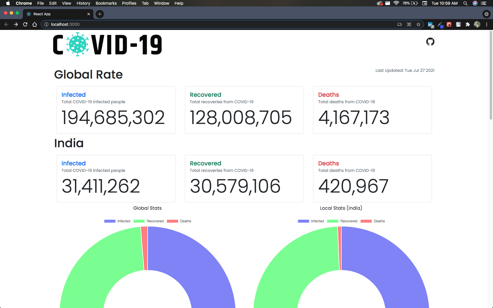
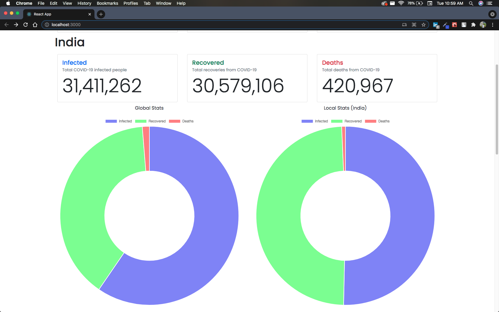
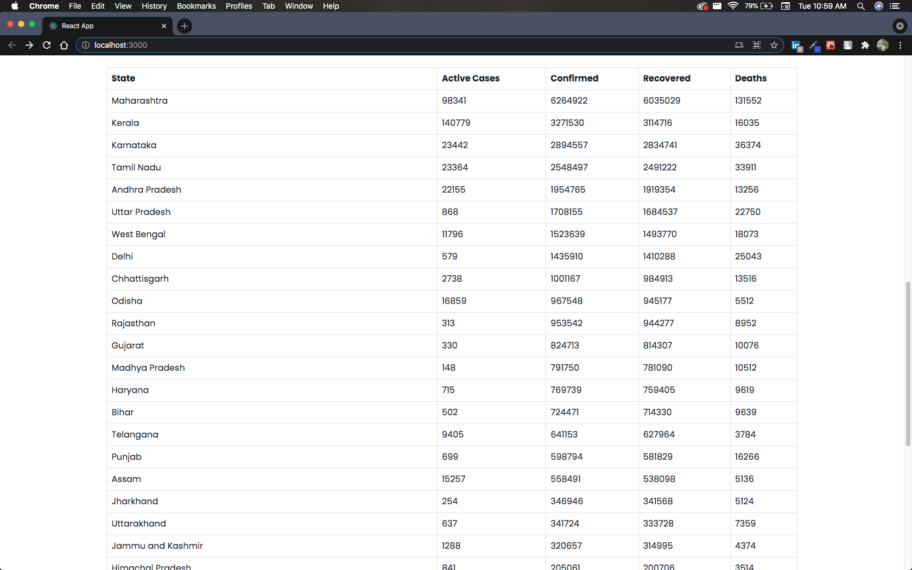

# COVID-19 Tracker
A COVID-19 tracker dashboard built using React.js and [mathdroid/covid-19-api](https://github.com/mathdroid/covid-19-api)
* Shows Global statistics
* Shows Local Statistics(India for now)
* Charts for both Global and Local stats.
* Statewise stats for India

### Get Started
```
$ git clone https://github.com/donymvarkey/covid-19-tracker.git
$ cd covid-19-tracker
$ npm install
$ npm start
```

### Screenshots




### Ideas yet to implement
- [ ] Get stats for any country(Select countries from a dropdown list) 
- [ ] UI refinement